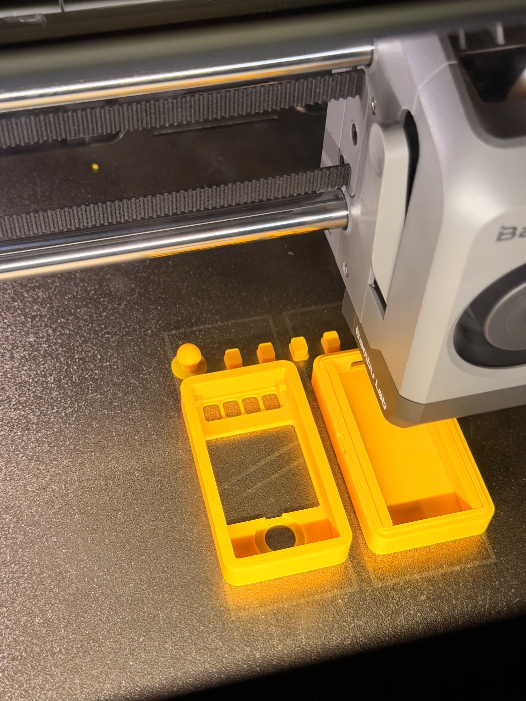
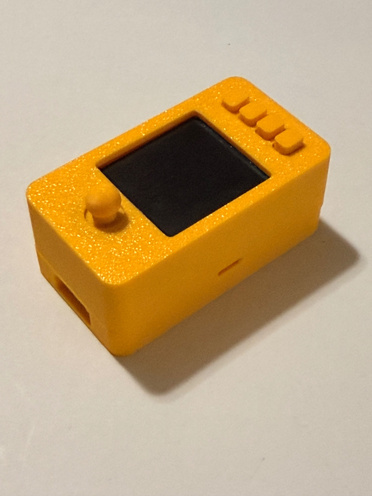

# S1 print history photo — received 2026-09-25

Austin supplied this photograph of his own case-development process for the
repository history. It shows yellow top/base shells, joystick cap and four
button caps on the printer plate, with the toolhead partly obscuring the base.
The layout is consistent with the S1 seven-part plate submitted from d57302f
and logged in [the S1 print record](../2026-09-25-s1-full-case.md).
This is visual production evidence, not a confirmed completion timestamp,
proof of exact geometry, or a physical fit result. No dimension taken from it.

Received filename: paste-6be18c30-IMG_0839.jpg. Public copy strips EXIF and
Photoshop metadata without changing decoded pixels. Original upload remains
untouched outside Git. Both full hashes and transformation are in
[IMG_0839.json](IMG_0839.json); utility [archive_photo.py](../../tools/archive_photo.py).
No precise capture time or location is claimed. Austin requested inclusion in
this MIT repository; no third-party case image was used as a design input.
## Assembled S1 — IMG_0840

Austin supplies two byte-identical uploads (prefixes 56146ab1 and fed322ed).
Archive one public copy. Shows his assembled yellow case with joystick,
four rectangular button caps, USB opening and single pry notch. Captioned
as S1 from the ongoing test context; no dimensions inferred. His accompanying
feedback: case nearly works, but closure has roughly 0.25 mm play and buttons
need more tactile separation. This records the baseline before S2, not proof
that S2 fits. Metadata removed without changing decoded pixels; original and
public hashes in [IMG_0840.json](IMG_0840.json). Original uploads untouched.
