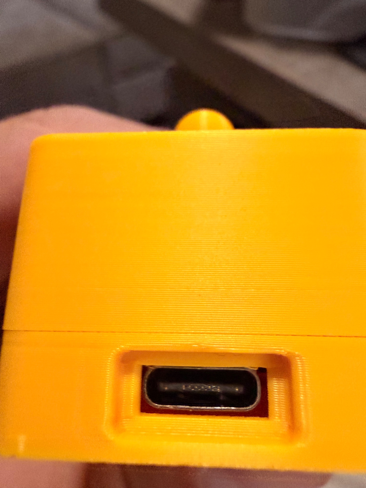
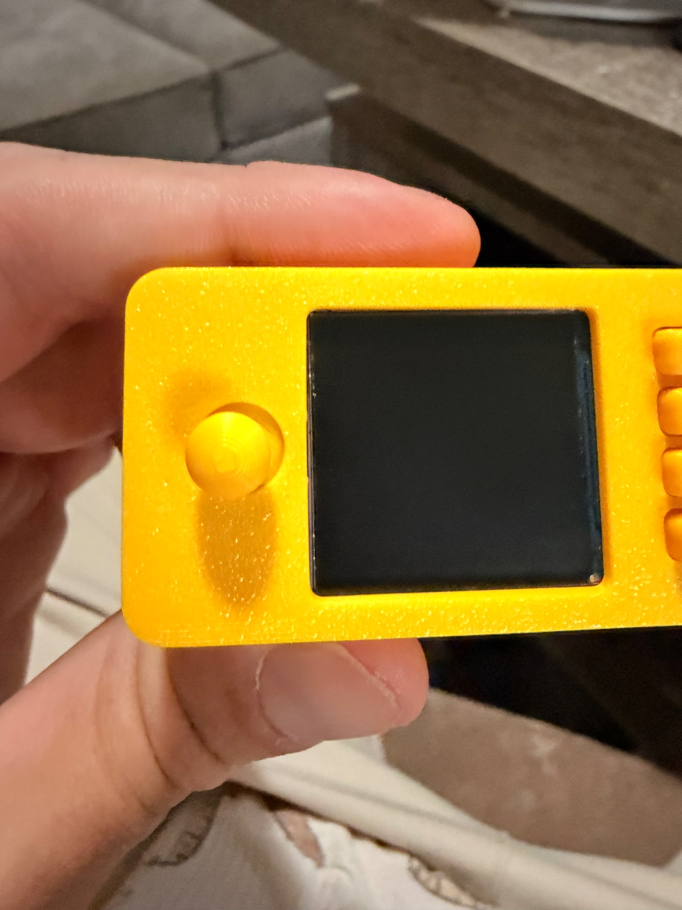
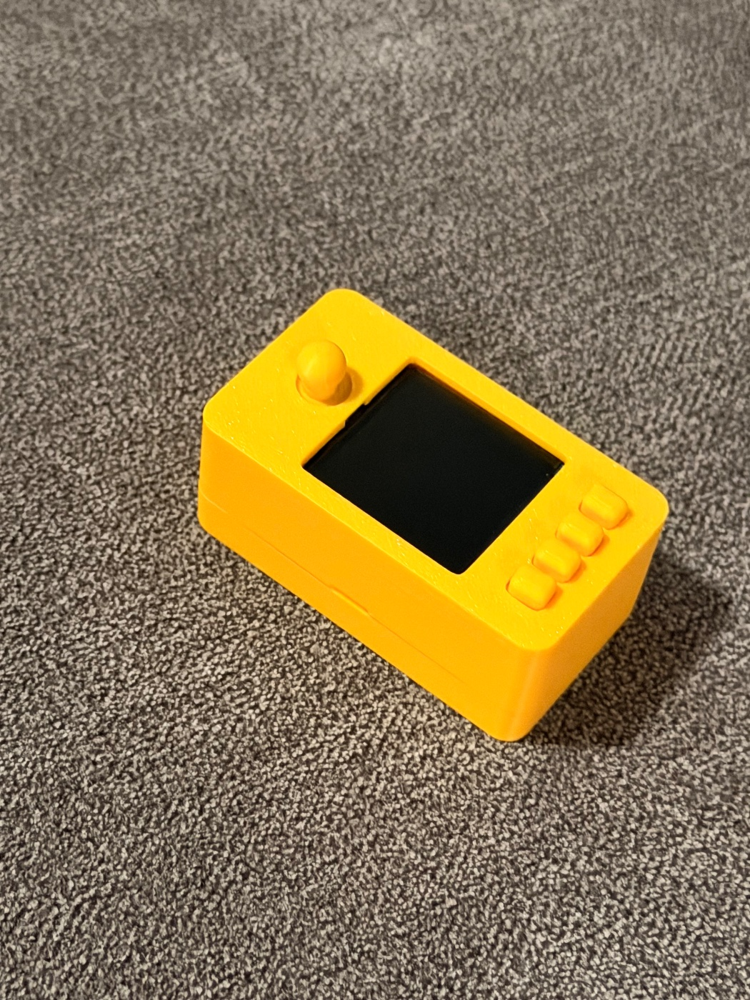
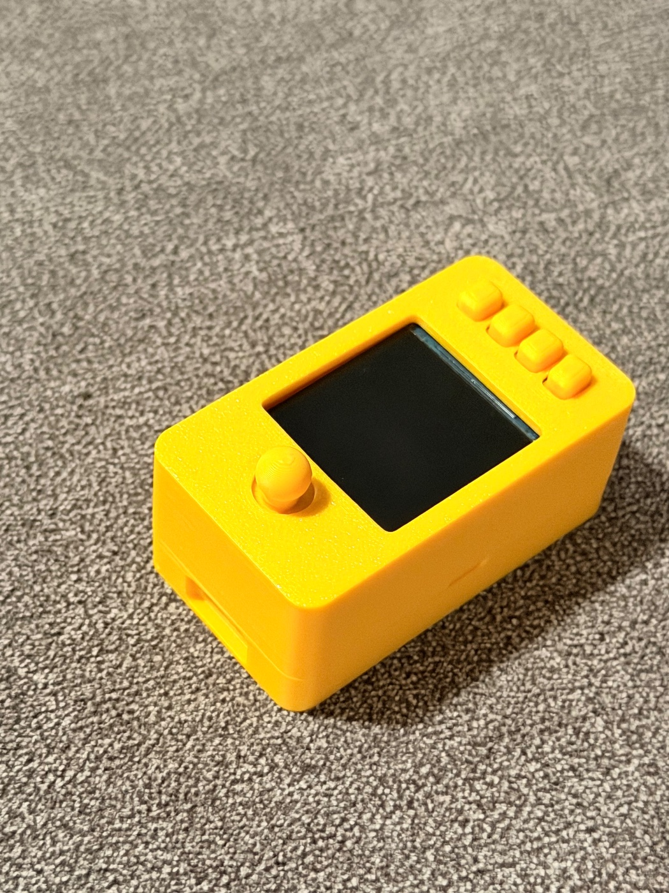
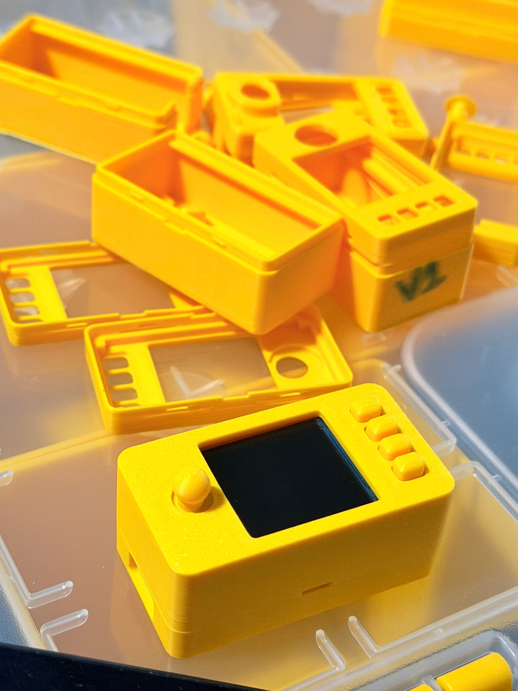

# V1.0 photos — 2026-09-25

Austin took these photos of his own printed S2 case (S1 lid, S2 base and
buttons, J2 joystick) and sent them for the record. Metadata is removed and
the decoded pixels are unchanged. The hashes of the original and public files
are in each `.json` file, and the original uploads stay outside Git. No
dimension was taken from any photo.

| Photo | Shows |
|---|---|
|  IMG_0844 | USB-C end. The receptacle sits against the top of the opening, so V1.0 raises the opening 0.25 mm |
|  IMG_0848 | Joystick close-up. The cap sits off-centre in its hole, so V1.0 moves the hole 0.25 mm away from the LCD |
|  IMG_0849 | Assembled case |
|  IMG_0852 | Assembled case, other side |
|  IMG_0854 | The working case on top of the discarded prototypes it replaced |
