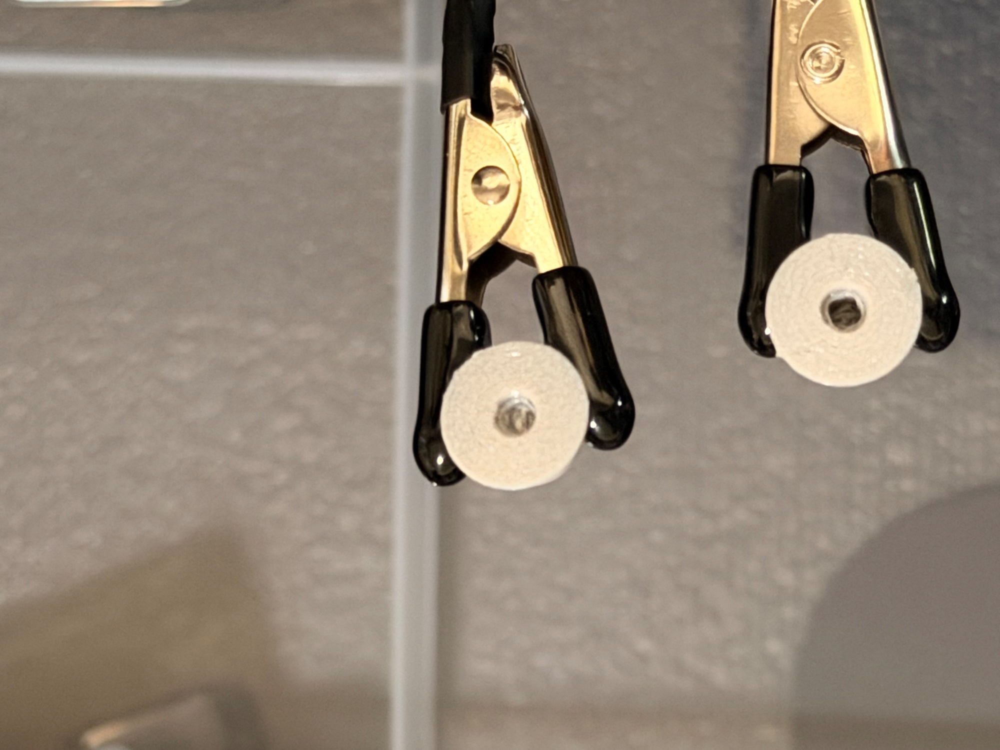
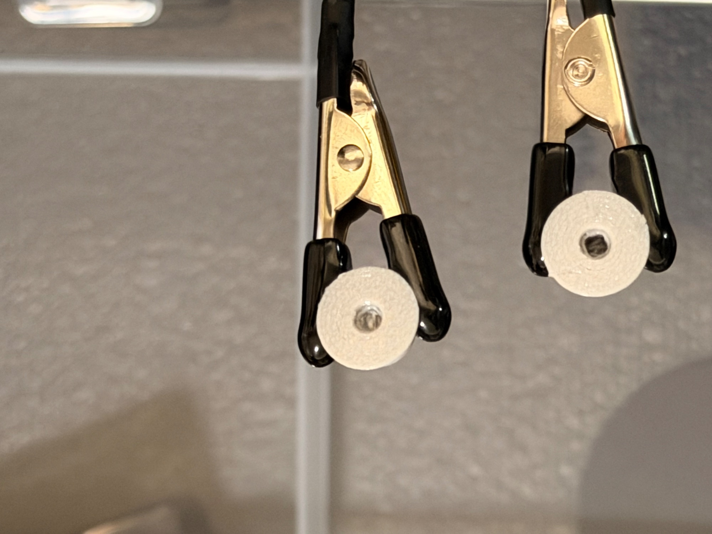

# J4 socket failure photos — 2026-09-26

Austin's photos compare a good J2 joystick socket with a failed J4 socket
(IMG_0880, IMG_0881). The metadata is removed and the pixels are unchanged;
hashes are in the `.json` files. No dimension was taken from them.

 

Cause (found in CAD, see `../2026-09-26-v1.4-joystick-j4-petg.md`): the
bigger J4 ball sphere filled the top 1.5 mm of the 2 mm square socket.
