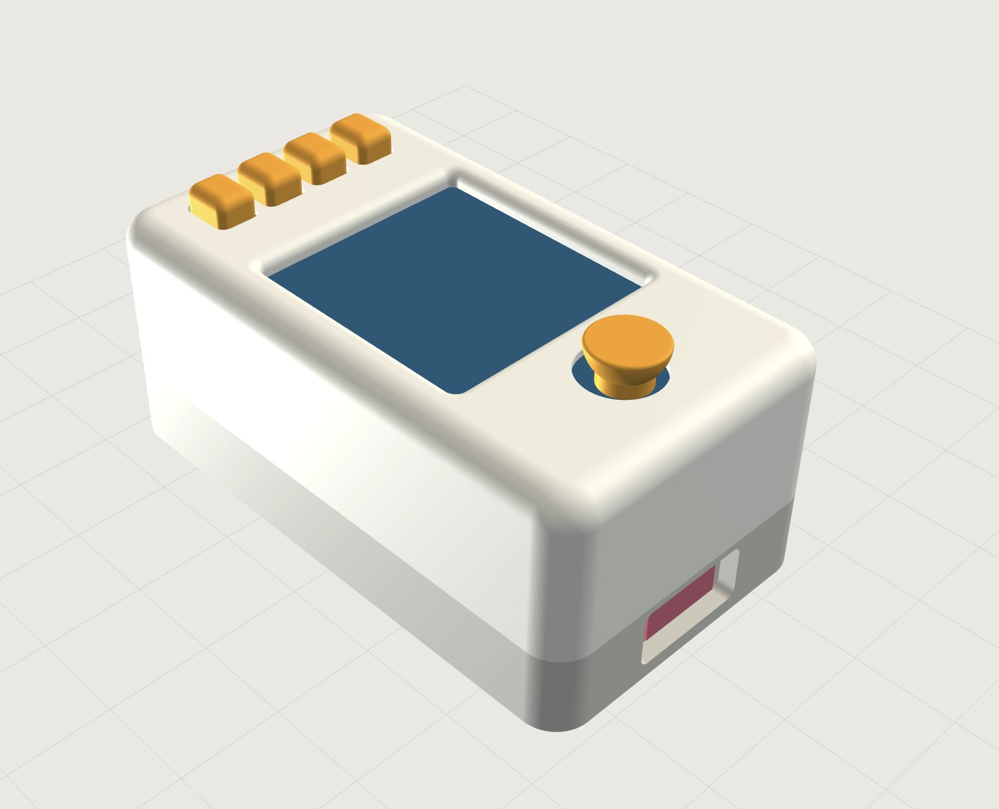

# v1.4 review renders

Austin's screenshot of the v1.4 3D viewer, 2026-09-26: a lid rounded 3.0 mm
on top, a screen window 1.0 mm smaller with a rounded 1.2 mm bezel, the J4
7.4 mm half-ball joystick, and the v1.3 base. The metadata (EXIF, XMP, ICC)
is removed and the decoded pixels are unchanged; hashes are in
`screenshot-2026-09-26.json`. It is a render, not a photo of a print.

The interactive model is `viewer.html`, built by `cad/v1_4_rounded.py`.
